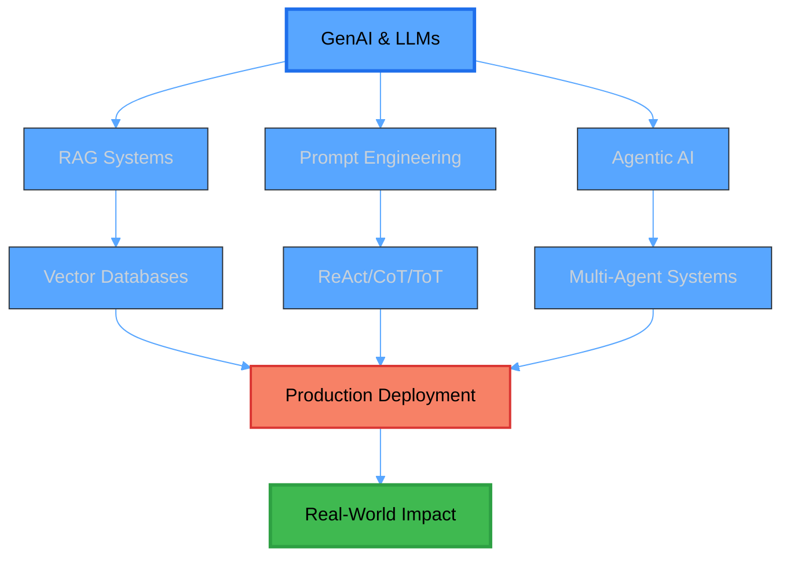

#  Hey, I'm Siranjeevi V

<div align="center">
  
[](https://git.io/typing-svg)

<picture>
  <source media="(prefers-color-scheme: dark)" srcset="https://img.shields.io/badge/AI%20Engineer-Building%20Intelligent%20Systems-2E9EF7?style=for-the-badge">
  <source media="(prefers-color-scheme: light)" srcset="https://img.shields.io/badge/AI%20Engineer-Building%20Intelligent%20Systems-0366D6?style=for-the-badge">
  
</picture>

</div>

<br>

<div align="center">
  
```ascii
╔═══════════════════════════════════════════════════════════════╗
║  🤖 Building Intelligent Systems with GenAI & LLMs           ║
║  🚀 Transforming Ideas into Production-Grade AI Solutions    ║
║  ⚡ Passionate about RAG, Agentic AI & ML Innovation         ║
╚═══════════════════════════════════════════════════════════════╝
```

</div>

---

## 🎯 About Me

```python
class SiranjeeviV:
    def __init__(self):
        self.role = "GenAI-Focused Software Developer"
        self.location = "India 🇮🇳"
        self.education = "B.E. Electronics & Communication Engineering"
        self.languages = ["Python", "JavaScript", "TypeScript", "SQL"]
        
        self.current_focus = [
            "🎯 Building Agentic AI Systems",
            "🔍 Advanced RAG Architectures", 
            "💬 NL-to-SQL Generation",
            "🚀 LLM Optimization & Fine-tuning"
        ]
        
    def get_expertise(self):
        return {
            "GenAI & LLMs": {
                "frameworks": ["LangChain", "DSPY", "Hugging Face"],
                "techniques": ["RAG", "Hybrid RAG", "Agentic AI"],
                "skills": ["Prompt Engineering", "ReAct", "CoT", "ToT"]
            },
            "ML & DL": ["CNN", "RNN", "LSTM", "YOLOv7", "NLP", "OCR"],
            "Backend": ["Python", "FastAPI", "REST APIs", "SQL Alchemy"],
            "Frontend": ["React.js", "TypeScript", "JavaScript", "Tailwind"],
            "Databases": ["PostgreSQL", "Redis", "FAISS", "ChromaDB", "Pinecone"],
            "Cloud & DevOps": ["AWS", "Docker", "Lambda", "EC2", "S3"]
        }
    
    def mission(self):
        return "Delivering production-grade AI solutions that drive real impact! 🎯"

# Initialize
me = SiranjeeviV()
print(me.mission())
```

---

## 🛠️ Technology Stack

<div align="center">

### 🧠 GenAI & LLMs
<picture>
  <source media="(prefers-color-scheme: dark)" srcset="https://skillicons.dev/icons?i=python,pytorch,tensorflow&theme=dark">
  <source media="(prefers-color-scheme: light)" srcset="https://skillicons.dev/icons?i=python,pytorch,tensorflow&theme=light">
  
</picture>


### 💻 Programming & Frameworks

<picture>
  <source media="(prefers-color-scheme: dark)" srcset="https://skillicons.dev/icons?i=py,fastapi,react,ts,js,html,css,tailwind&theme=dark">
  <source media="(prefers-color-scheme: light)" srcset="https://skillicons.dev/icons?i=py,fastapi,react,ts,js,html,css,tailwind&theme=light">
  
</picture>

### 🗄️ Databases & Vector Stores

<picture>
  <source media="(prefers-color-scheme: dark)" srcset="https://skillicons.dev/icons?i=postgres,redis,sqlite&theme=dark">
  <source media="(prefers-color-scheme: light)" srcset="https://skillicons.dev/icons?i=postgres,redis,sqlite&theme=light">
  
</picture>


### ☁️ Cloud & DevOps

<picture>
  <source media="(prefers-color-scheme: dark)" srcset="https://skillicons.dev/icons?i=aws,docker,git,linux,nginx&theme=dark">
  <source media="(prefers-color-scheme: light)" srcset="https://skillicons.dev/icons?i=aws,docker,git,linux,nginx&theme=light">
  
</picture>

### 🤖 AI/ML Tools

<picture>
  <source media="(prefers-color-scheme: dark)" srcset="https://skillicons.dev/icons?i=opencv,sklearn&theme=dark">
  <source media="(prefers-color-scheme: light)" srcset="https://skillicons.dev/icons?i=opencv,sklearn&theme=light">
  
</picture>


</div>

---

## 💼 Professional Journey

<table>
<tr>
<td width="30%" align="center">

### 🚀 Tarka Labs
**Software Developer**  
*June 2025 - Present*

</td>
<td width="70%">

**🎯 Key Contributions:**
- Built GenAI-based **NL-to-SQL system** enabling natural language database querying
- Implemented **agent-based orchestration** with ReAct, CoT, and ToT prompting techniques
- Designed robust **validation & error-handling** logic for edge cases
- Deployed production system on **AWS EC2** with Caddy web server
- Contributed to **React.js frontend** development

**💡 Tech Stack:** `LangChain` `FastAPI` `React.js` `AWS EC2` `PostgreSQL`

</td>
</tr>
<tr>
<td width="30%" align="center">

### 🤖 Frost & Sullivan
**AI Engineer**  
*July 2024 - June 2025*

</td>
<td width="70%">

**🎯 Key Contributions:**
- Designed **production-grade GenAI systems** for research automation
- Built **RAG, Hybrid RAG, and Agentic RAG** applications
- Developed **context-aware research assistants** with LLaMA models
- Achieved **50% reduction** in analyst effort through automation
- Optimized infrastructure, **reducing costs by 60%**
- Built **ETL pipelines** for geospatial data analysis with GeoPandas

**💡 Tech Stack:** `LangChain` `RAG` `AWS Lambda` `Redis` `ChromaDB` `FAISS`

</td>
</tr>
<tr>
<td width="30%" align="center">

### 🏭 ZF Rane Automotive
**Python Developer**  
*June 2023 - Jan 2024*

</td>
<td width="70%">

**🎯 Key Contributions:**
- Developed **OCR-based product label validation** system
- Built **AI-powered safety monitoring** with YOLOv7 & CNN
- Achieved **90% PPE detection accuracy** in production
- Integrated AI with **manufacturing systems** for safety compliance
- Designed secure internal **QA web application**

**💡 Tech Stack:** `YOLOv7` `PyTesseract` `OpenCV` `CNN` `Flask`

</td>
</tr>
</table>

---

## 🏆 Impact & Achievements

<div align="center">

<table>
<tr>
<th>📊 Metric</th>
<th>💯 Achievement</th>
<th>🎯 Project</th>
<th>🔧 Technology</th>
</tr>
<tr>
<td><b>50%</b></td>
<td>Analyst Effort Reduction</td>
<td>Research Automation</td>
<td>RAG + LangChain</td>
</tr>
<tr>
<td><b>60%</b></td>
<td>Infrastructure Cost Savings</td>
<td>LLM Optimization</td>
<td>Prompt Engineering + AWS</td>
</tr>
<tr>
<td><b>90%</b></td>
<td>Detection Accuracy</td>
<td>Industrial Safety AI</td>
<td>YOLOv7 + CNN</td>
</tr>
<tr>
<td><b>100%</b></td>
<td>Label Validation Automation</td>
<td>OCR QA System</td>
<td>PyTesseract + OpenCV</td>
</tr>
</table>

</div>

---

## 🔥 Featured Projects

<div align="center">

<table>
<tr>
<td width="50%" valign="top">

### 🤖 NL-to-SQL Agentic System


**Description:** Advanced GenAI system converting natural language queries to optimized SQL

**Key Features:**
- ⚙️ Agent-based orchestration
- 🧠 ReAct & Chain-of-Thought prompting
- 🛡️ Production-grade error handling
- 🚀 Real-time query execution

**Tech:** `LangChain` `FastAPI` `PostgreSQL` `AWS`

</td>
<td width="50%" valign="top">

### 🔍 Hybrid RAG Research Assistant


**Description:** Context-aware AI assistant automating secondary research workflows

**Key Features:**
- 🎯 Multi-stage retrieval pipeline
- 🔎 Vector search + reranking
- 💾 Session memory with Redis
- 📊 Real-time data synthesis

**Tech:** `LLaMA` `ChromaDB` `Redis` `LangChain`

</td>
</tr>
<tr>
<td width="50%" valign="top">

### 👁️ Industrial Safety Monitor


**Description:** Real-time AI-powered safety compliance monitoring system

**Key Features:**
- 🎥 Real-time video processing
- 👷 PPE compliance detection
- ⚠️ Automatic alert system
- 🏭 Manufacturing integration

**Tech:** `YOLOv7` `OpenCV` `CNN` `Python`

</td>
<td width="50%" valign="top">

### 📝 OCR Label Validator


**Description:** Automated product label validation for manufacturing QA

**Key Features:**
- 📸 Image-based OCR extraction
- ✅ Real-time validation logic
- 🔍 Duplicate detection
- 🌐 Internal web dashboard

**Tech:** `PyTesseract` `OpenCV` `Flask` `Python`

</td>
</tr>
</table>

</div>

---

## 📈 GitHub Analytics

<div align="center">

<picture>
  <source media="(prefers-color-scheme: dark)" srcset="https://github-readme-stats.vercel.app/api?username=siranjeevi&show_icons=true&theme=github_dark&include_all_commits=true&count_private=true&hide_border=true&title_color=58A6FF&icon_color=1F6FEB&text_color=C9D1D9&bg_color=0D1117" />
  <source media="(prefers-color-scheme: light)" srcset="https://github-readme-stats.vercel.app/api?username=siranjeevi&show_icons=true&theme=default&include_all_commits=true&count_private=true&hide_border=true&title_color=0366D6&icon_color=0969DA&text_color=24292F&bg_color=FFFFFF" />
  
</picture>

<picture>
  <source media="(prefers-color-scheme: dark)" srcset="https://github-readme-stats.vercel.app/api/top-langs/?username=siranjeevi&layout=compact&langs_count=8&theme=github_dark&hide_border=true&title_color=58A6FF&text_color=C9D1D9&bg_color=0D1117" />
  <source media="(prefers-color-scheme: light)" srcset="https://github-readme-stats.vercel.app/api/top-langs/?username=siranjeevi&layout=compact&langs_count=8&theme=default&hide_border=true&title_color=0366D6&text_color=24292F&bg_color=FFFFFF" />
  
</picture>

</div>

<div align="center">
  
<picture>
  <source media="(prefers-color-scheme: dark)" srcset="https://github-readme-streak-stats.herokuapp.com/?user=siranjeevi&theme=github-dark-blue&hide_border=true&background=0D1117&ring=58A6FF&fire=58A6FF&currStreakLabel=58A6FF" />
  <source media="(prefers-color-scheme: light)" srcset="https://github-readme-streak-stats.herokuapp.com/?user=siranjeevi&theme=default&hide_border=true&background=FFFFFF&ring=0366D6&fire=F66A0A&currStreakLabel=24292F" />
  
</picture>

</div>

<div align="center">

### 🏆 GitHub Trophies

<picture>
  <source media="(prefers-color-scheme: dark)" srcset="https://github-profile-trophy.vercel.app/?username=siranjeevi&theme=algolia&no-frame=true&no-bg=true&row=1&column=7" />
  <source media="(prefers-color-scheme: light)" srcset="https://github-profile-trophy.vercel.app/?username=siranjeevi&theme=flat&no-frame=true&no-bg=true&row=1&column=7" />
  
</picture>

</div>

---

## 🎓 Expertise Areas

<div align="center">



</div>

---

## 🌟 Current Focus & Learning

<div align="center">

| 🎯 Area | 📚 Topics | 🛠️ Tools & Frameworks |
|---------|-----------|------------------------|
| **Advanced RAG** | Hybrid retrieval, Agentic workflows, Context optimization | LangChain, FAISS, ChromaDB |
| **LLM Engineering** | Fine-tuning, Prompt optimization, Inference speed | OpenAI API, Hugging Face, DSPY |
| **Production AI** | Scalability, Monitoring, Cost optimization | AWS, Docker, FastAPI |
| **Emerging Tech** | Multimodal LLMs, Tool use, Agent frameworks | Latest GenAI tools |

</div>

---

## 💡 Technical Writing & Knowledge Sharing

<div align="center">

### 📝 Topics I'm Passionate About

[](#)
[](#)
[](#)
[](#)

</div>

---

## 💬 Let's Connect & Collaborate!

<div align="center">

[](https://linkedin.com/in/siranjeevi)
[](https://github.com/siranjeevi)
[](mailto:siranjeevi@example.com)
[](https://siranjeevi.dev)

<br>

### 💭 Random Dev Wisdom

<picture>
  <source media="(prefers-color-scheme: dark)" srcset="https://quotes-github-readme.vercel.app/api?type=horizontal&theme=dark" />
  <source media="(prefers-color-scheme: light)" srcset="https://quotes-github-readme.vercel.app/api?type=horizontal&theme=light" />
  
</picture>

<br>

### 🐍 Contribution Activity


<br>

### 👀 Profile Views

<picture>
  <source media="(prefers-color-scheme: dark)" srcset="https://komarev.com/ghpvc/?username=siranjeevi&color=58A6FF&style=for-the-badge&label=PROFILE+VIEWS" />
  <source media="(prefers-color-scheme: light)" srcset="https://komarev.com/ghpvc/?username=siranjeevi&color=0366D6&style=for-the-badge&label=PROFILE+VIEWS" />
  
</picture>

</div>

---

<div align="center">

### 📌 Pinned Repositories

*Check out my pinned repositories below for my best work! ⭐*

<br>

**💡 Pro Tip:** If you find my projects helpful, consider giving them a ⭐  
**🤝 Open to:** Collaborations, Open Source contributions, and interesting AI projects!  
**📫 Best way to reach me:** LinkedIn DM or Email

<br>

---

<br>

### 🎯 "Building the future, one AI model at a time"

<br>

<picture>
  <source media="(prefers-color-scheme: dark)" srcset="https://capsule-render.vercel.app/api?type=waving&color=gradient&customColorList=6,11,20&height=120&section=footer&text=Thanks%20for%20visiting!&fontSize=24&fontColor=fff&animation=twinkling&fontAlignY=70" />
  <source media="(prefers-color-scheme: light)" srcset="https://capsule-render.vercel.app/api?type=waving&color=gradient&customColorList=0,1,2&height=120&section=footer&text=Thanks%20for%20visiting!&fontSize=24&fontColor=333&animation=twinkling&fontAlignY=70" />
  
</picture>

</div>
