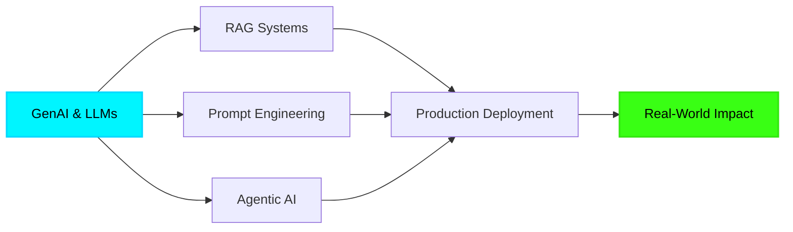
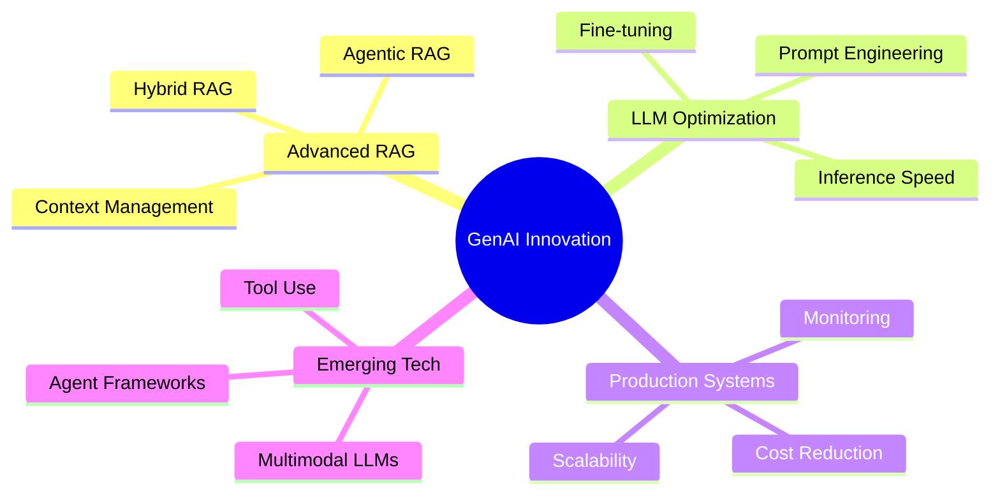

#  Hey, I'm Siranjeevi V

<div align="center">
  
[](https://git.io/typing-svg)

</div>

<div align="center">
  
```ascii
╔══════════════════════════════════════════════════════════════╗
║  🤖 Building Intelligent Systems with GenAI & LLMs          ║
║  🚀 Transforming Ideas into Production-Grade AI Solutions   ║
║  ⚡ Passionate about RAG, Agentic AI & ML Innovation        ║
╚══════════════════════════════════════════════════════════════╝
```

</div>

---

## 🎯 About Me

```python
class SiranjeeviV:
    def __init__(self):
        self.role = "GenAI-Focused Software Developer"
        self.location = "India 🇮🇳"
        self.education = "B.E. Electronics & Communication Engineering"
        self.current_focus = [
            "Building Agentic AI Systems",
            "Advanced RAG Architectures", 
            "NL-to-SQL Generation",
            "LLM Optimization & Fine-tuning"
        ]
        
    def get_expertise(self):
        return {
            "genai": ["RAG", "Hybrid RAG", "Agentic AI", "Prompt Engineering"],
            "ml_dl": ["CNN", "RNN", "LSTM", "YOLOv7", "NLP", "OCR"],
            "backend": ["Python", "FastAPI", "REST APIs", "SQL Alchemy"],
            "frontend": ["React.js", "TypeScript", "JavaScript", "Tailwind CSS"],
            "databases": ["PostgreSQL", "Redis", "FAISS", "ChromaDB", "Pinecone"],
            "cloud": ["AWS (Lambda, EC2, S3, Bedrock)", "Docker"],
            "llm_tools": ["LangChain", "DSPY", "OpenAI API", "Ollama", "Hugging Face"]
        }
    
    def current_mission(self):
        return "Delivering production-grade AI solutions that actually work! 🎯"

me = SiranjeeviV()
print(me.current_mission())
```

---

## 🛠️ Tech Stack & Tools

<div align="center">

### 🧠 GenAI & LLMs


### 💻 Programming & Frameworks


### 🤖 Machine Learning & Deep Learning


### 🗄️ Databases & Vector Stores


### ☁️ Cloud & DevOps


</div>

---

## 💼 Professional Experience

<details open>
<summary><b>🚀 Tarka Labs - Software Developer (June 2025 - Present)</b></summary>
<br>

```diff
+ Built GenAI-based NL-to-SQL system for natural language database querying
+ Implemented agent-based orchestration with ReAct, CoT, and ToT prompting
+ Designed validation logic for ambiguous queries and edge cases
+ Deployed on AWS EC2 with Caddy web server
+ Contributed to React.js frontend development
```

**Tech Stack:** `LangChain` `FastAPI` `React.js` `AWS EC2` `PostgreSQL` `Prompt Engineering`

</details>

<details>
<summary><b>🤖 Frost & Sullivan - AI Engineer (July 2024 - June 2025)</b></summary>
<br>

```diff
+ Designed production-grade GenAI systems for research automation
+ Built RAG, Hybrid RAG, and Agentic RAG applications
+ Developed context-aware research assistants with LLaMA models
+ Achieved 50% reduction in analyst effort through automation
+ Optimized infrastructure, reducing costs by 60%
+ Built ETL pipelines for geospatial data analysis
```

**Key Achievement:** Automated secondary research workflows, saving hundreds of hours

**Tech Stack:** `LangChain` `RAG` `AWS Lambda` `Redis` `ChromaDB` `FAISS` `GeoPandas`

</details>

<details>
<summary><b>🏭 ZF Rane Automotive - Python Developer (June 2023 - Jan 2024)</b></summary>
<br>

```diff
+ Developed OCR-based product label validation system
+ Built AI-powered safety monitoring with YOLOv7 & CNN
+ Achieved 90% PPE detection accuracy
+ Integrated AI with manufacturing systems for safety compliance
```

**Tech Stack:** `YOLOv7` `PyTesseract` `OpenCV` `CNN` `Flask`

</details>

---

## 🏆 Key Achievements & Impact

<div align="center">

| 🎯 Metric | 📊 Impact | 💡 Project |
|-----------|-----------|------------|
| **50%** | Analyst Effort Reduction | Research Automation System |
| **60%** | Infrastructure Cost Savings | LLM Optimization & Prompt Engineering |
| **90%** | Detection Accuracy | Industrial Safety AI System |
| **100%** | Label Validation Automation | OCR-based QA System |

</div>

---

## 🔥 Featured Projects

<div align="center">

<table>
<tr>
<td width="50%">

### 🤖 NL-to-SQL Agentic System
Advanced GenAI system converting natural language to optimized SQL queries
- Agent-based orchestration
- ReAct & Chain-of-Thought prompting
- Production-grade error handling
- **Stack:** LangChain, FastAPI, PostgreSQL

</td>
<td width="50%">

### 🔍 Hybrid RAG Research Assistant
Context-aware AI assistant for research automation
- Multi-stage retrieval pipeline
- Vector search + reranking
- Session memory with Redis
- **Stack:** LLaMA, ChromaDB, Redis

</td>
</tr>
<tr>
<td width="50%">

### 👁️ Industrial Safety Monitor
Real-time AI-powered safety compliance system
- YOLOv7 object detection
- PPE compliance checking
- 90% accuracy in production
- **Stack:** YOLOv7, OpenCV, CNN

</td>
<td width="50%">

### 📝 OCR Label Validator
Automated product validation system
- PyTesseract OCR engine
- Real-time validation logic
- 100% automation coverage
- **Stack:** PyTesseract, OpenCV, Flask

</td>
</tr>
</table>

</div>

---

## 📈 GitHub Stats

<div align="center">
  


</div>

<div align="center">
  
[](https://git.io/streak-stats)

</div>

---

## 🎓 Certifications & Learning



---

## 🌟 Current Focus Areas

<div align="center">



</div>

---

## 💬 Let's Connect!

<div align="center">

[](https://linkedin.com/in/siranjeevi)
[](https://github.com/siranjeevi)
[](mailto:siranjeevi@example.com)
[](https://siranjeevi.dev)

</div>

---

<div align="center">

### 💭 Random Dev Quote


### 🐍 Contribution Graph


</div>

---

<div align="center">

### 📊 Profile Views


### ⭐ Show some love!

If you like my work, consider giving a ⭐ to my repositories!

</div>

---

<div align="center">
  
**"Building the future, one AI model at a time"** 🚀


</div>
